# 学生宿舍管理系统
##### 前提：本系统是在以往Web大作业上进行的修改

#### 1）项目设计部分

（1）总体构成：

该项目使用nodejs+express+mongodb开发。

用户分为管理员（宿管）和普通用户（学生）。普通用户可实现的主要功能包括对自己缺寝信息的查看，自己用户信息的查看。管理员可实现的主要功能包括查看所有学生的信息，添加缺寝信息，删除缺寝信息，查看用户信息。

（2）引入包说明

- express：配置服务器路由
- mongoose：实现对数据库的增删改差等操作
- bodyParser：读取post数据
- session：使用session实现用户信息共享
- connect-multiparty：文件信息的上传
- bootstrap：页面美化

（3）项目目录和数据库设计

*目录结构如下：

```html
├── app.js
├── doc
├── modules
├── node_modules
├── package.json
├── package-lock.json
├── public
└── views
```

其中：

- app.js：实现该项目主要功能的代码
- doc：保存说明文档里的图片
- node_modules：各种导入包的文件
- package.json+package-lock.json：导入包的信息
- modules：数据库的连接，相关表的定义

```html
modules
├── db.js   连接数据库
├── record.js  缺寝信息表
├── service.js 相关数据库的操作函数
└── user.js  用户信息表
```

- views：项目中的所有页面

```html
views
├── addque.ejs  添加缺寝信息页面
├── adinfo.ejs  查看管理员信息页面
├── a_index.ejs  管理员登陆页面
├── a_lf.ejs  
├── a_reg.ejs  管理员注册页面
├── index.ejs  首页
├── lf.ejs
├── link.ejs
├── login.ejs  登陆页面
├── recordlist.ejs  展示缺寝记录列表页面
├── reg.ejs  普通用户注册页面
├── s_index.ejs  普通用户首页
├── sname_record.ejs 普通用户查看自己缺寝信息页面
├── studentInfo.ejs  查看普通用户信息页面
├── top.ejs 
└── userlist.ejs  查看普通用户列表页面
```

*数据库设计

**user表**

|   名称   | 数据类型 |  含义  |
| :------: | :------: | :----: |
| username |  String  | 用户名 |
| password |  String  |  密码  |
|   sno    |  Number  |  学号  |
|   ano    |  Number  |  工号  |
| building |  String  |  楼栋  |
|   room   |  String  | 寝室号 |
|   sex    |  String  |  性别  |

**record表**

|   名称   | 数据类型 |  含义  |
| :------: | :------: | :----: |
| username |  String  | 用户名 |
|   sno    |  Number  |  学号  |
|   date   |  String  |  日期  |
|  detail  |  String  |  备注  |
| building |  String  |  楼栋  |
|   room   |  String  | 寝室号 |

#### 2）使用说明书

- **首页**

进入本系统的首页

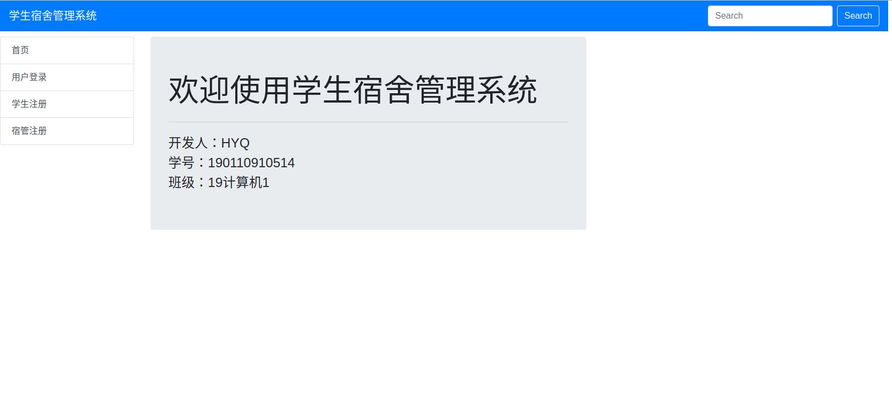

- **注册页面**

此页面实现用户的注册功能，不同用户选择不同注册页面

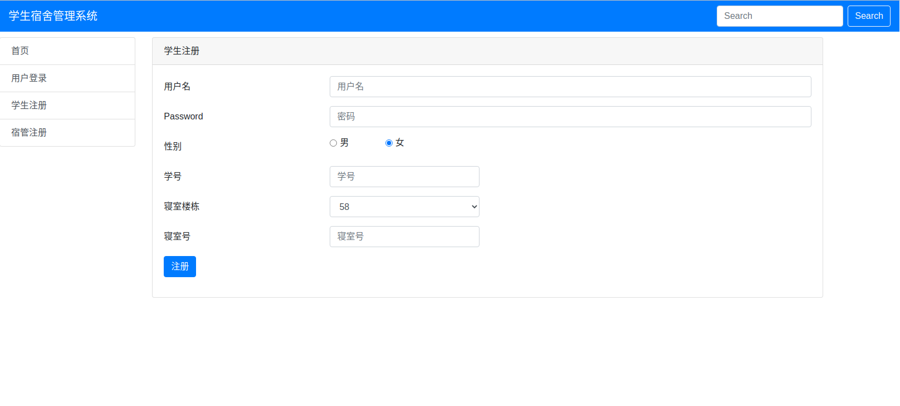


- **登陆页面**

当注册成功后，会自动跳转至登陆页面，并提示“注册成功！“。本页面用户在身份处选择相应身份，不同身份进入的页面不同。

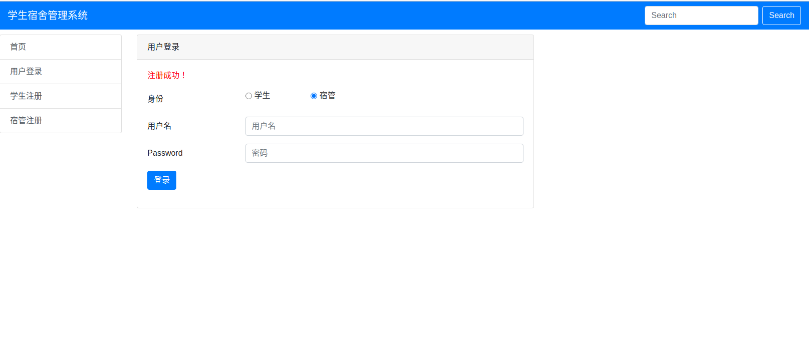

**管理员身份**

- **主页面**

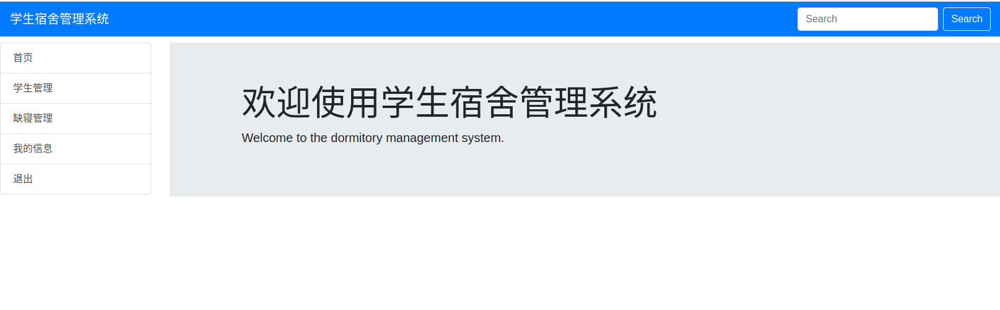

- **学生管理页面**

该页面会显示所有的学生信息，在次页面可以执行添加缺寝的功能。

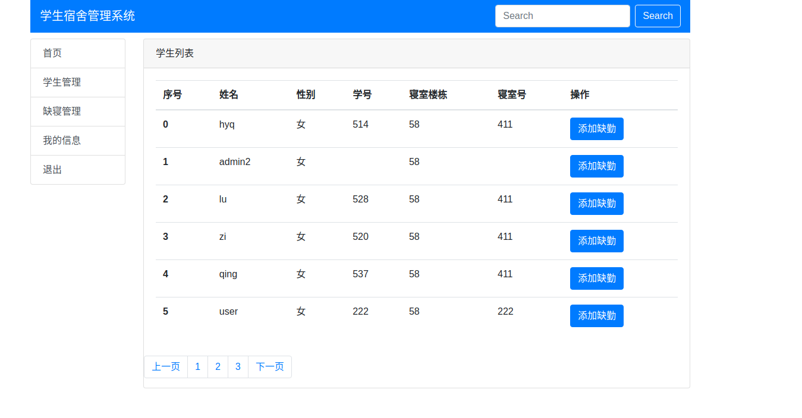

- **添加缺寝**

点击按钮来到本页面，填入相关信息，添加成功后会有相关提示。

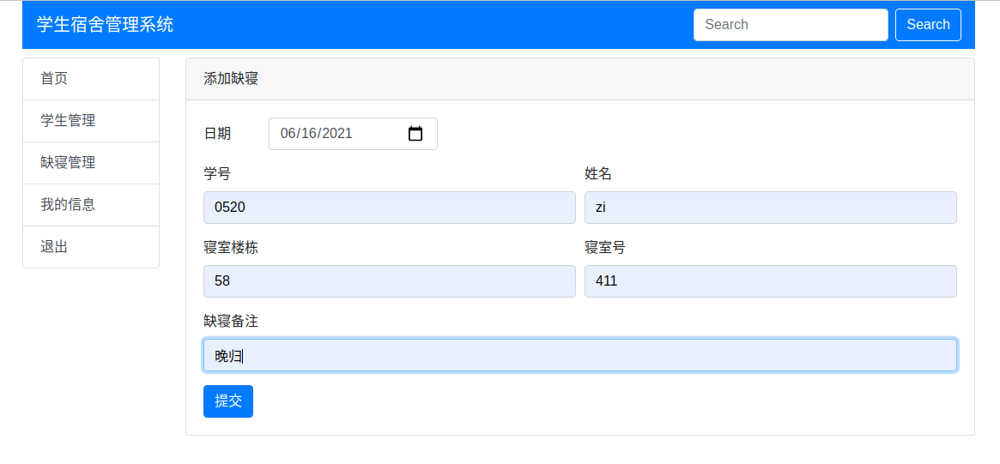

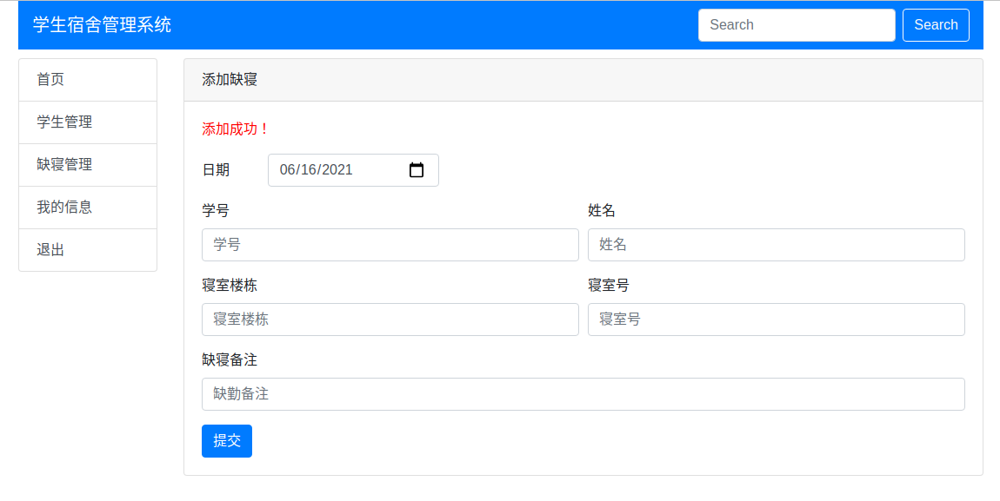

- **缺寝管理页面**

该页面可以查看到所有的缺寝记录，在此处可以执行删除记录的操作，点击按钮后可以删除该条记录。


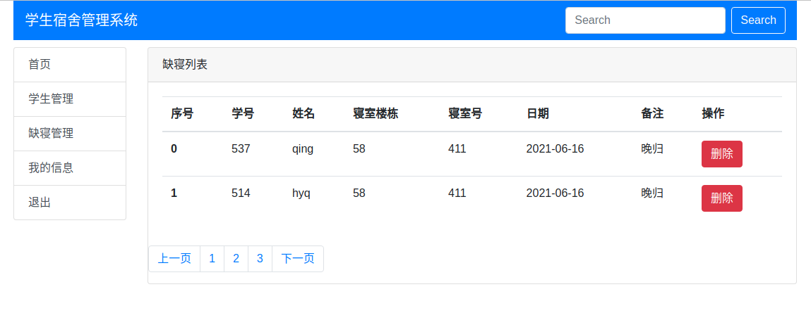

- **我的信息页面**

在我的信息页面可以看到该用户的全部信息。


**普通用户身份**

- **主页面**

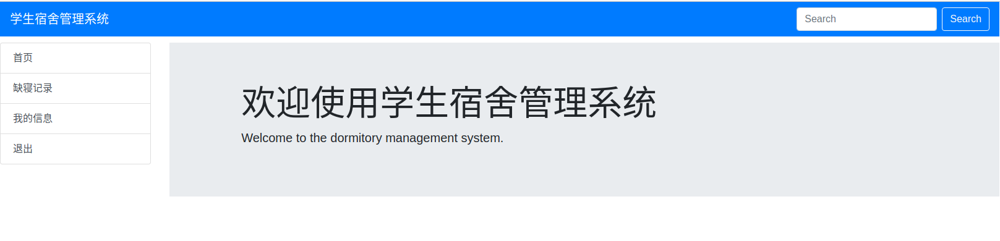

- **缺寝记录页面**

在该页面可以查看自己的缺寝信息。

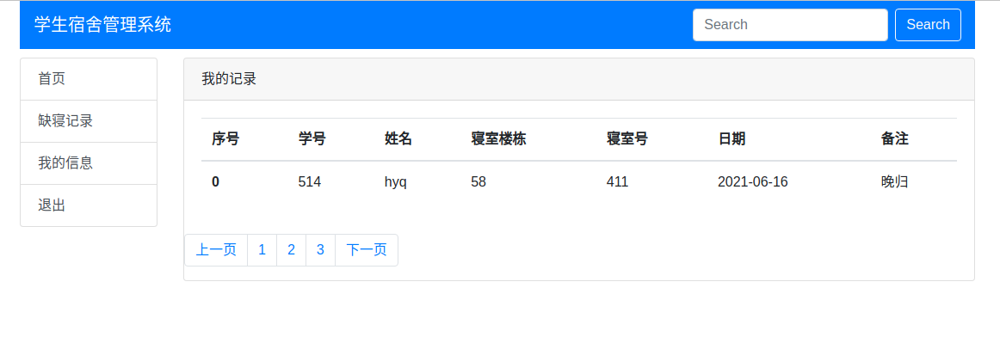

- **我的信息页面**

该页面可以看到本用户的全部信息。

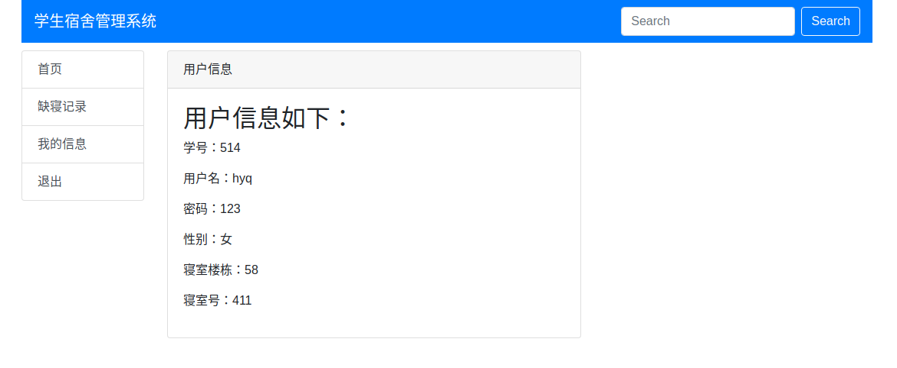

- **点击退出栏可以返回到项目的首页**

#### 3）开发日记

##### 2021.12.20～2021.12.21 --first

- 相关包的下载安装，环境的配置
- 基本页面的创建，数据库的连接和相关表的设计

##### 2021.12.22 --实现登陆注册

- 注册登陆功能的实现

##### 2021.12.23～2021.12.26--大部分功能的实现，问题修改

- 主要功能的实现，包括信息的增加删除，信息列表的展示等
- 页面的美化

##### 2021.12.27~2021.12.29 

- 修复bug
- 优化页面
- 书写项目说明文档

##### 2021.12.30

- 更新说明文档


